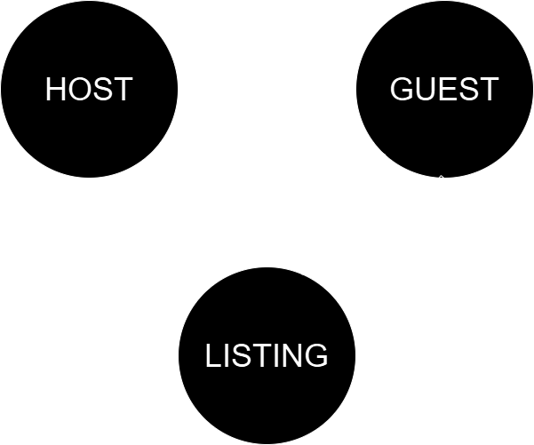

# Analysis of AirBnB Listing Data Using Neo4j

## Class: CS 673 Scalable Databases - Fall 2024, Pace University
## Instructor: Professor Anthony Escalona
## Student: Joshua Gottlieb (joshuadavidgottlieb@gmail.com, jg05394n@pace.edu)

## Project Overview and Problem Definition

AirBnB is a company that facilitates the short term rental of properties to guests as an alternative to hotel stays. This project aims to analyze AirBnB's data to investigate the relationships between hosts, listings, and guests. A primary goal is to demonstrate potential applications of a graph database to extract insights from the data and facilitate viable real-world applications for tasks such as customer recommendation, customer profiling, marketing, and real-estate investment analysis.

The data was obtained from [Inside AirBnB](https://insideairbnb.com/get-the-data/) and uses the data for New York City. The two files used were listings.csv and reviews.csv and were accessed on December 14, 2024. These data files are saved under [data/raw](data/raw), compressed with the lzma algorithm to reduce file size.

## Graph Structure and Reasons to Use Neo4j Over SQL



One of the primary benefits of a graph database over a relational one is that modeling data which is highly interconnected is simpler and more natural. Rather than having to create extra intermediate tables to model many-to-many relations, the relations can be added directly as additional edges between nodes. In theory, the data follows the above entity relation diagram; however, the data itself does not contain extensive information on reviews, such as ratings per review. It also does not contain information about stays, such as duration. Therefore, the "reviews" data was used as a stand-in for guest stays at a particular listing.

An additional benefit of Neo4j is that nodes which have many copies of the same relation between each other are trivial to model. For example, each time a guest stays at a particular listing, there is a new relation between the guest and the listing which can simply be added as a new edge with an edge property denoting the date of the stay. This makes the graph database easy to scale and maintain overtime, compared to a relational database which may need updates across many tables to maintain consistency and currency.

The selected properties for each node can be found in the [data preparation module](src/modules/database_population.py), with further explanations of each property available in the [source data dictionary from Inside AirBnB](https://docs.google.com/spreadsheets/d/1iWCNJcSutYqpULSQHlNyGInUvHg2BoUGoNRIGa6Szc4/).

## Repository Design

Preprocessing for the data was done in Python and can be found in the [Data Wrangling](src/Data-Wrangling.ipynb) notebook. The data was relatively clean; however, it contained a number of missing values. Rather than handle null values using Neo4j, the missing values were cleaned or dropped using Pandas. Many data types were fixed during this process to ensure logical consistency, such as making sure ID fields were encoded as integers and that prices were encoded as floats rather than strings using $ signs. The only data type that was not changed was a date column which was left as a string, as the files were saved to compressed csv files for ease of storage and loading, and csv files do not preserve datetime objects.

Populating the nodes and relations was done programatically from Pandas dataframes using Python in the [Database Creation](src/Database-Creation.ipynb) notebook. Neo4j offers a Python API that allows the execution of any Cypher statement. Using Python allows for more flexibility in data manipulation using functions rather than working exclusively through Cypher. Indexes were created on a number of properties to help facilitate searches and aggregations.

Some sample queries on the data, including explanations and screenshots of outputs, are documented in the [Queries and Visualizations](src/Queries-and-Visualizations.pdf) pdf.

## Database Loading

The database dump file was unable to be compressed enough to abide by GitHub's upload limits. The Neo4j dump file can be found at [this Google Drive location](https://drive.google.com/drive/folders/1BcSlD-42Y7WsMGsHHQQoVnSzxTUPF3nj?usp=sharing). The database can be regenerated from the neo4j.dump file using Neo4j desktop by creating a new project, then selecting Add ->  File and selecting the .dump file, then selecting the options next to the file and selecting "Import dump into existing DBMS".

Alternatively, the database can be built from the ground up using the [Database Creation](src/Database-Creation.ipynb) notebook. By default, the project was created using the following credentials - URI: 'neo4j://localhost:7687', auth: ('neo4j', 'password'), database_name: 'neo4j'. If the local project was created using different credentials, these lines will need to be changed in the notebook. It should be noted that the creation of the database may take a long time, the current project required ~14 hours to build from the raw data.

## Future Enhancements

- Acquire more data to create more feature-rich nodes. For example, adding duration of stay data and individual review ratings to create more relations between Guest and Listing nodes. This would also increase the fidelity of the graph model, since it is currently assumed that a review represents a one day stay, so stays of Guests without reviews are lost in the current data. Having the duration of the stay would also allow more accuracy with regards to the revenue generated by each listing.
- Factor out certain node properties as nodes themselves to allow graph-like traversal in searches. For example, Neighborhood and Borough can be nodes which connect to Listings, rather than just existing as Listing node properties.
- Refactor the database population module into a Class to eliminate the need to pass in many common parameters which could be stored as class attributes. For example, driver and database_name.
- Investigate the use of Python libraries such as yfiles_jupyter_graphs_for_neo4j to allow the display of Cypher query results directly in Jupyter Notebooks.

## Respository Structure
```
.
|── data/                                              # Raw and cleaned data, as well as the unzipped SQLite database
|   ├── raw/                                           # Raw data obtained from Inside AirBnB
|   |	├── listings.csv.xz
|   |	└── reviews.csv.xz
|   ├── cleaned/                                       # Cleaned data sets almost entirely ready for input into database
|   |	├── hosts.csv.xz
|   |	├── listings.csv.xz
|   |	└── reviewers.csv.xz                           # Used to create Guest nodes and Guest - STAYS -> Listing relations
|   └── database/
|   	└── neo4j.dump                                 # Not included in repository, available at linked Google Drive
|── src/                                               # Notebooks, Modules, ERD, and Queries
|   ├── Data-Wrangling.ipynb
|   ├── Database-Creation.ipynb
|   ├── Queries-and-Visualizations.pdf
|   ├── AirBnB-ERD.png
|   └── modules/                                      # Modules used by notebooks go here
|   	├── __init__.py
|   	└── database_population.py
```

## Libraries and Versions
```
# Minimal versions of Python libraries needed
numpy==1.24.4
pandas==2.0.3
neo4j==5.27.0

# Minimal versions of software needed
Python 3.8.10
Neo4j 5.24.0
```
